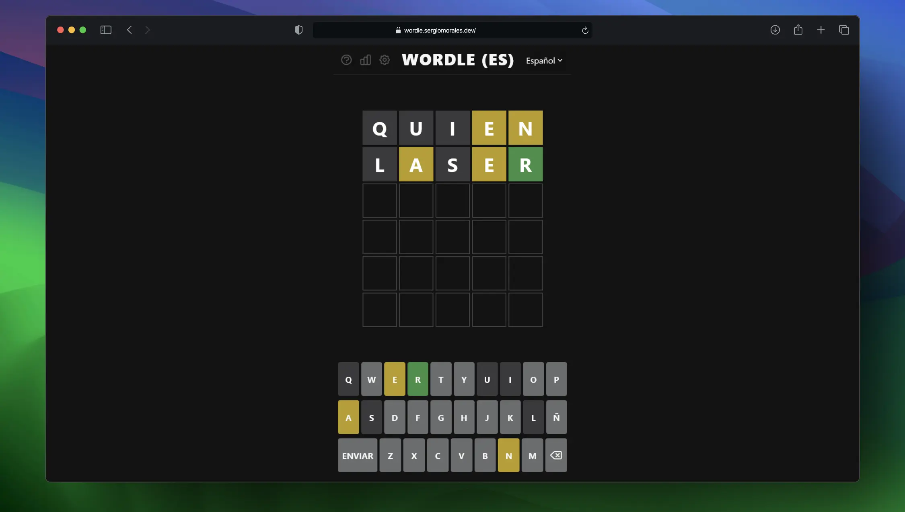

# Wordle Multilingüe



Juego tipo Wordle en React, con soporte para varios idiomas y funcionalidades avanzadas.

## Características principales

- **Idiomas soportados:** Español, Inglés, Catalán, Euskera, Gallego
- **Modo palabra diaria:** Adivina la palabra del día en cada idioma
- **Modo ilimitado:** Juega tantas veces como quieras con palabras aleatorias
- **Definiciones:** Cada palabra tiene su definición, visible tras cada partida
- **Autenticación:** Guarda tu progreso y estadísticas usando Firebase
- **Estadísticas:** Racha, intentos, palabras completadas por idioma
- **Accesibilidad:** Modo daltónico, modo accesible, modo oscuro
- **Internacionalización:** Interfaz traducida a todos los idiomas soportados
- **Responsive:** Adaptado para móvil y escritorio

## Estructura del proyecto

- `src/` - Código fuente principal
  - `components/` - Componentes React (tablero, teclado, opciones, estadísticas, etc.)
  - `auth/` - Autenticación y servicios de usuario (Firebase)
  - `data/` - Palabras y definiciones por idioma
  - `i18n/` - Traducciones y constantes de internacionalización
  - `Words.jsx` - Lógica de selección de palabras y definiciones
  - `App.jsx` - Componente principal y contexto global
- `public/` - Archivos estáticos e imagen principal
- `docs/` - Documentación y versión estática

## Tecnologías utilizadas

- React
- Vite
- TailwindCSS
- Firebase (autenticación y base de datos)
- ESLint

## Instalación y ejecución

1. Clona el repositorio:
   ```sh
   git clone https://github.com/Sergitxin22/wordle.git
   cd wordle
   ```
2. Instala dependencias:
   ```sh
   npm install
   ```
3. Ejecuta en modo desarrollo:
   ```sh
   npm run dev
   ```
4. Accede a `http://localhost:5173`

## Contribuir

¡Las contribuciones son bienvenidas! Puedes abrir issues o pull requests para sugerir mejoras, nuevos idiomas o funcionalidades.

## Licencia

MIT

Este proyecto está bajo la licencia MIT, lo que significa que puedes usar, copiar, modificar, fusionar, publicar, distribuir, sublicenciar y/o vender copias del software, siempre que incluyas el aviso de copyright original y la licencia en cualquier copia del software o parte sustancial del mismo. ¡Eres libre de crear tus propias versiones y compartirlas!

> Proyecto creado por [Sergio Morales](https://github.com/Sergitxin22). Inspirado en el Wordle original y adaptado para varios idiomas.